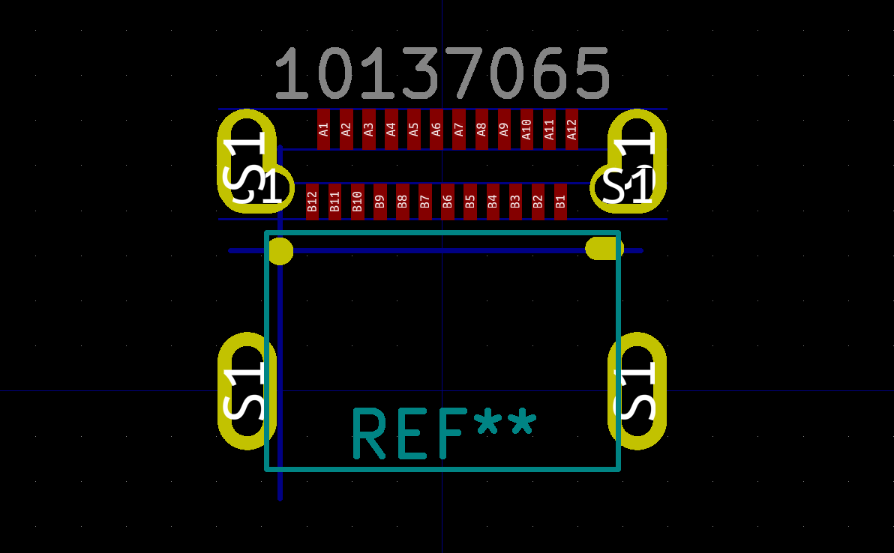
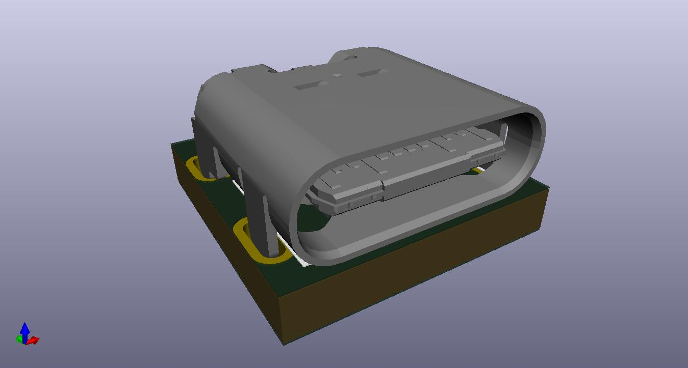
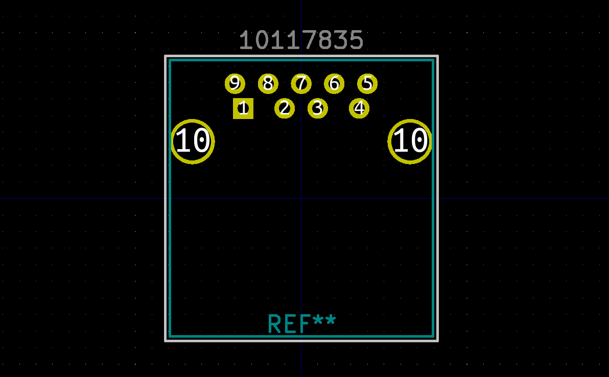
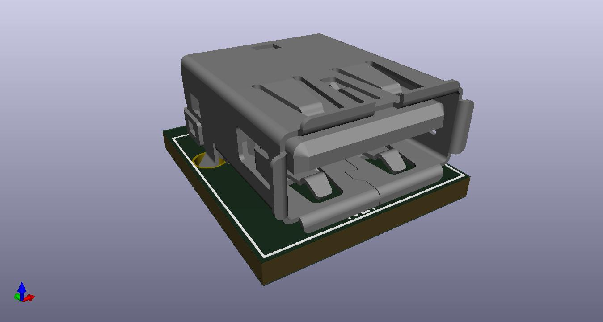
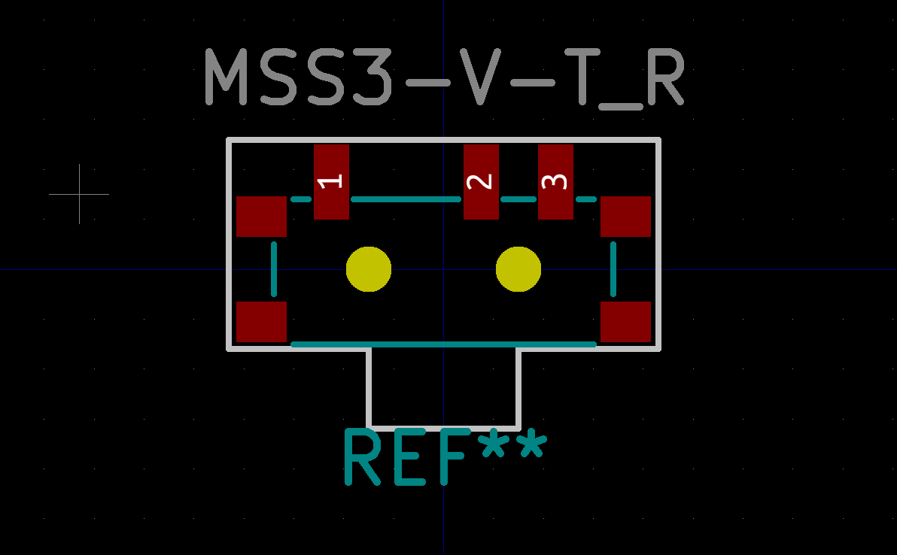

# KiCad Library

KiCad footprints I created or imported that you might find useful

## Connectors: USB

### USB C Receptacle: Amphenol ICC 10137065-00021LF

- [Footprint](Connector_USB.pretty/USB_C_Receptacle_Amphenol_10137065.kicad_mod)
- [3D Model](Connector_USB.3dshapes/USB_C_Receptacle_Amphenol_10137065.stp) from Amphenol

### USB A Receptacle: Amphenol ICC 10117835-002LF

- [Footprint](Connector_USB.pretty/USB_A_Receptacle_Amphenol_10117835.kicad_mod)
- [3D Model](Connector_USB.3dshapes/USB_A_Receptacle_Amphenol_10117835.stp) from Amphenol

## Buttons, Switches: SMD

### SPDT: Multicomp MSS3-V-T/R

- [Footprint](Button_Switch_SMD.pretty/SW_SPDT_MSS3-V-T_R.kicad_mod)

<!-- vim: set conceallevel=2 et ts=2 sw=2: -->

